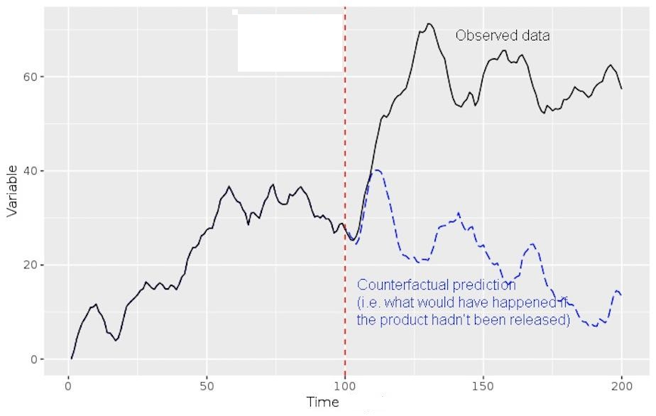
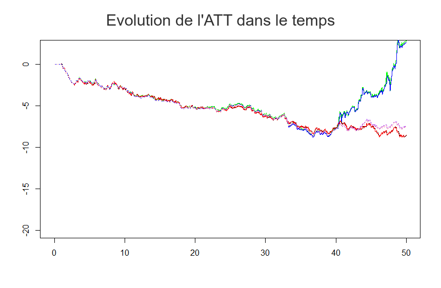

# VINGARCH_Etude_longitudinale

Résultats d'étude réalisé lors d'un stage à l'INSERM concernant le calcul d'un estimateur clinique l'ATT ( Average treatment on the treated ) dans un contexte non randomisé et sans groupe de controle.  

### I) Contexte :

Dans le cadre d’une étude clinique longitudinale, la question de l’efficacité du
traitement est centrale. Il existe dans ce contexte différents indicateur permettant
d’y répondre, l’ATT ( average treatment effect on the treated ) en est un exemple im-
portant.
Comme son nom l’indique cet indicateur permet de calculer l’effet moyen d’un trai-
tement sur le groupe des individus qui ont été traités. Dans le cadre d’une étude non
randomisée cet indicateur peut être estimer à l’aide de méthodes statistiques.
L’une des méthodes est développée par Gran et al. dans l’article ”Estimating the
treatment effect on the treated under time-dependent confounding in an application
to the Swiss HIV Cohort Study”  
L'idée de l'article est d'apprendre un modèle sur l'évolution du risque chez les individuts non traitées puis d'utiliser ce modèle pour créer des variables contre-factuelles afin d'estimer l'efficacité du traitement.  
Plus précisément on apprend un modèle VAR ( Vectorial Autoregressive model ) sur les temps ou les individuts ne sont pas traitées et on en déduit des contrefactuelles pour les temps ou ces memes individuts sont traitées. Voici une image permettant de représenter la situation mentionné :

  

### II) Restriction de l'article et but du projet : 

L'article se restreint a des covariables continues, le but du projet est d'étendre l'étude réalisé à des covariables discrètes. Pour ce faire un équivalent aux modèles de séries temporelles VAR doit être trouvé. Ce repo contient la mise en place d'un modèle de séries temporelles vectorielle discrètes ( VINGARCH ) inspiré des modèles INGARCH ainsi que l'inclusion de ce modèle dans le calcul de l'ATT dans une étude non randomisée et sans groupe de controle.

### III) Code et Simulation :  

Un code ( non encore publié ) à été réaliser pour générer et estimer des séries de type VINGARCH ainsi que pour faire des simulations dans un contexte d'études cliniques. Des calculs d'ATT avec et sans correction du biais ont été réaliser et coincident avec le cas continu.

### IV) Illustration :

Voici une illustration du calcul de l'ATT dans une simulation de 50 patients suivi sur une pèriode de 50 unités de temps :  

  

  

- La courbe rouge correspond à la valeur théorique ( "vrai valeur" ) de l'efficacité du traitement l'ATT  
- Les courbes verte ( obtenue par la méthode d'Aalen ) et bleu ( obtenue par la méthode des moindres carrés ) correspondent à la valeur de l'ATT obtenu a partir du modèle VINGARCH sans correction du biais  
- Les courbes violette ( obtenue avec la variance théorique ) et rose ( obtenue par la variance estimé ) correspondent à la valeur de l'ATT obtenu a partir du modèle VINGARCH avec correction du biais  

On remarque une nette amélioration de l'estimation de l'ATT après correction, plus précisement voici un tableau recapitulatif du risque MISE ( mean integrated squared error ) de la différence entre l'ATT théorique et l'ATT calculé avec et sans correction :  

| Modèle |  MISE |   
|-----------|-----------| 
| Aalen sans correction |  312.140 |  
| Moindres carrés sans correction  |  324.397  |  
| Correction avec variance exacte |   3.996   |  
| Correction avec variance estimé |   4.446     |
